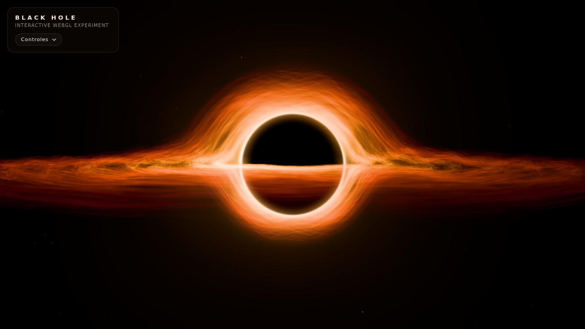

# Black Hole

**Interactive WebGL Experiment** · Three.js · GLSL · sem build



## Descrição

Um projeto básico, porém visualmente interessante, criado para explorar animações 3D, WebGL e shaders através de uma representação interativa de um buraco negro.

A cena mostra um horizonte de eventos absolutamente preto, um photon ring fino e dezenas de milhares de fragmentos luminosos orbitando em um disco de acreção. A luz da parte de trás do disco é desviada pela gravidade e aparece como um arco por cima e por baixo da sombra, como nas visualizações clássicas de buracos negros.

Tudo roda no navegador, direto de arquivos estáticos: não há `npm install`, bundler nem etapa de build.

## Demonstração

- **Local:** veja [Como executar](#como-executar). Leva menos de um minuto.
- **GitHub Pages:** o projeto é 100% estático e funciona no Pages sem nenhuma alteração. Para publicar, vá em *Settings → Pages → Build and deployment*, escolha *Deploy from a branch*, selecione a branch `main` e a pasta `/ (root)`. O endereço fica assim: `https://helio965.github.io/Black-Hole/`.

## Funcionalidades

- **Horizonte de eventos** totalmente preto, que nenhuma luz revela.
- **Photon ring** fino e brilhante com aura quente (branco → amarelo → laranja → vermelho).
- **Disco de acreção com ~60 000 fragmentos** (24 000 em celulares) desenhados em uma única geometria instanciada.
- **Órbitas keplerianas**: fragmentos internos giram muito mais rápido que os externos (`ω ∝ r^-3/2`).
- **Turbulência procedural** com *simplex noise*, que tira o disco do plano e ondula as trilhas.
- **Temperatura por raio**: branco/amarelo perto do centro, laranja no meio e vermelho escuro nas bordas. As trilhas "esfriam" (ficam mais vermelhas) enquanto desaparecem.
- **Doppler relativístico aproximado**: o lado que vem em direção à câmera fica mais claro e quente, e o lado oposto mais escuro e avermelhado.
- **Lente gravitacional aproximada**: o disco de trás se curva por cima da sombra e forma um arco secundário por baixo. As estrelas do fundo também são lenteadas.
- **Campo de estrelas discreto**, com leve paralaxe e cintilação.
- **Bloom HDR** que nunca invade a sombra (o centro continua preto).
- **OrbitControls** com inércia, zoom limitado (a câmera nunca entra no buraco) e reset animado.
- **Painel de controles minimalista**: velocidade, intensidade, partículas, inclinação, lente, Doppler e estrelas.
- **Responsivo**: ocupa 100% da janela, sem scrollbars, e funciona com toque no celular.
- **Qualidade adaptativa**: reduz a resolução e depois as partículas se o FPS cair.

## Tecnologias utilizadas

| Tecnologia | Uso |
| --- | --- |
| HTML5 + CSS3 | Estrutura, HUD e painel de controles |
| JavaScript (ES Modules) | Lógica da cena, sem frameworks |
| [Three.js r170](https://threejs.org/) | Renderer WebGL, câmera, geometrias e materiais |
| WebGL 2 + GLSL | Órbitas, lente, Doppler e cores calculados na GPU |
| `OrbitControls` | Câmera interativa (addon oficial do Three.js) |
| `EffectComposer` + `UnrealBloomPass` + `OutputPass` | Bloom HDR e tone mapping (addons oficiais do Three.js) |

O Three.js é carregado via **importmap** a partir do jsDelivr. Nenhuma outra biblioteca é usada.

## Como executar

> **Dois cliques no `index.html` não funcionam.** Os navegadores bloqueiam módulos JavaScript (ES Modules) em arquivos abertos direto do disco (`file://`): o painel aparece, mas a cena fica preta. Nesse caso a própria página mostra um aviso com as instruções abaixo. O projeto precisa ser aberto por um servidor local (`http://localhost`).

### Windows: dois cliques em `iniciar.bat`

1. Baixe o projeto (*Code → Download ZIP*) e extraia a pasta.
2. Dê dois cliques em **`iniciar.bat`**.
3. O navegador abre sozinho em `http://localhost:8000`. Deixe a janela preta aberta enquanto usa o projeto e feche-a para parar.

O `iniciar.bat` roda `tools/servidor.ps1`, um mini servidor em PowerShell, que já vem no Windows, então não é preciso instalar nada. Se o Windows perguntar se pode executar o arquivo baixado, clique em *Mais informações → Executar assim mesmo*.

### Qualquer sistema: um servidor estático

```bash
git clone https://github.com/Helio965/Black-Hole.git
cd Black-Hole

# Python 3 (já vem no macOS e na maioria das distribuições Linux)
python -m http.server 8000

# ou Node.js
npx serve .
```

Depois abra **http://localhost:8000** no navegador (a porta muda se você usar outro servidor). No VS Code, a extensão *Live Server* também funciona.

Parâmetros opcionais de URL:

| URL | Efeito |
| --- | --- |
| `?quality=high` | Força a qualidade máxima e desliga o ajuste automático |
| `?quality=low` | Força o perfil leve (o mesmo usado em celulares) |

## Estrutura do projeto

```
/
├── index.html            # página, importmap do Three.js e markup do HUD
├── css/
│   └── style.css         # tela cheia, HUD e painel de controles
├── js/
│   ├── main.js           # renderer, cena, câmera, controles, bloom e loop de animação
│   ├── blackHole.js      # horizonte de eventos (esfera preta) + photon ring
│   ├── accretionDisk.js  # geometria instanciada do disco e atributos por partícula
│   ├── stars.js          # campo de estrelas (THREE.Points)
│   ├── shaders.js        # todos os shaders GLSL (noise, lente, disco, anel, estrelas)
│   ├── quality.js        # perfil por dispositivo e governador de FPS
│   ├── ui.js             # painel de controles e dica de interação
│   └── random.js         # PRNG com semente (a cena é igual em todo carregamento)
├── docs/
│   └── preview.jpg       # imagem usada neste README
├── tools/
│   └── servidor.ps1      # mini servidor local em PowerShell (usado pelo iniciar.bat)
├── iniciar.bat           # Windows: dois cliques para abrir no navegador
├── README.md
├── .gitattributes        # quebras de linha CRLF para os arquivos do Windows
├── .gitignore
└── LICENSE
```

## Controles

| Ação | Mouse / teclado | Toque |
| --- | --- | --- |
| Girar a câmera | clicar e arrastar | arrastar com um dedo |
| Zoom | roda do mouse | pinça |
| Abrir/fechar o painel | botão **Controles** (Esc fecha) | botão **Controles** |

Opções do painel:

| Controle | Faixa | Descrição |
| --- | --- | --- |
| Velocidade | 0 – 3× | Ritmo das órbitas e da turbulência (0 pausa o disco) |
| Intensidade | 0.2 – 2.5 | Brilho do disco e do photon ring |
| Partículas | 10 – 100% | Quantos fragmentos são desenhados |
| Inclinação do disco | −30° – +30° | Inclina o disco em torno do eixo X |
| Lente gravitacional | 0 – 2 | 0 desliga a curvatura da luz; 1 é a lente fraca "física"; o padrão é 1.3 |
| Doppler | 0 – 1 | Intensidade do efeito Doppler/beaming |
| Estrelas | on/off | Mostra ou esconde o fundo estrelado |
| Resetar câmera | — | Volta suavemente para a vista inicial |

Quem prefere movimento reduzido (`prefers-reduced-motion`) recebe o disco girando mais devagar por padrão.

## Como funciona

A unidade da cena é o **raio de Schwarzschild** (`Rs = 1`).

### 1. Horizonte de eventos e photon ring

- O buraco é uma `SphereGeometry` com `MeshBasicMaterial` preto. Não recebe luz, então nunca revela a superfície, e grava profundidade, o que esconde tudo que passa atrás dele. O raio é `2.6 Rs` (≈ `3√3/2 Rs`), o tamanho aparente da **sombra** de um buraco negro de Schwarzschild.
- O photon ring é um quad sempre voltado para a câmera. O fragment shader converte cada pixel em um **ângulo** a partir do centro e o compara com o ângulo da silhueta (`asin(R / D)`), por isso o anel fica sempre colado à borda da sombra em qualquer zoom. O lado do anel que se move em direção à câmera recebe um pouco mais de brilho.

### 2. Disco de acreção

- Uma única `InstancedBufferGeometry` contém uma fita pequena (7 × 2 vértices) e, para cada instância, 8 números: raio, ângulo inicial, altura, brilho relativo, comprimento da trilha, largura, brilho e variação de velocidade.
- O **vertex shader** calcula a órbita inteira na GPU:

  ```
  ω = K · r^(-3/2)                 // Kepler: v ∝ 1/√r
  φ = φ0 + ω · t − s · trilha      // s = posição ao longo da fita (cabeça → cauda)
  y = (offset + noise(x, z, t)) · espessura(r)
  ```

  Cada vértice da fita fica em um ponto ligeiramente anterior da órbita, então os fragmentos viram **trilhas curvas**. A fita é orientada para a câmera em torno da própria direção de movimento.
- Por frame, a CPU atualiza apenas alguns *uniforms* (`uTime`, `uFlowTime`...). Nenhuma matriz é recalculada e nenhum objeto é criado dentro do loop.
- As cores vêm de uma rampa de temperatura (vermelho escuro → vermelho → laranja → amarelo → branco) que depende do raio, do brilho relativo da partícula e do Doppler. A mistura é **aditiva**, em um buffer HDR (half-float).

### 3. Doppler relativístico (aproximado)

Com a velocidade orbital `β ≈ √(0.5 / (r − 1))` (escalada pelo controle "Doppler") e o ângulo entre o movimento e a câmera:

```
δ = 1 / (γ · (1 − β·cos θ))       brilho ∝ δ³       temperatura ∝ δ
```

Com o valor padrão, o lado que se aproxima fica cerca de 1.8× mais brilhante que o lado que se afasta.

### 4. Lente gravitacional (aproximada)

Aplicada **por vértice**, em espaço de câmera, com a equação da lente fina para uma massa pontual:

```
θ± = ( β ± √(β² + 4·θE²) ) / 2        θE² = 2·Rs·Dls / (Dl·Ds)
```

- **Imagem primária (θ+)**: tudo o que está atrás do buraco é empurrado para fora do anel de Einstein. É isso que levanta a parte de trás do disco por cima da sombra.
- **Imagem secundária**: o disco é desenhado uma segunda vez (mesma geometria, outro material), do lado oposto do buraco. Na aproximação de campo fraco, essa imagem cairia quase toda dentro da sombra. Perto de um buraco negro real (campo forte), ela "abraça" a sombra. Por isso ela é desenhada como um **espelho comprimido da imagem primária**, com peso dado pela magnificação `μ−` da lente pontual. O resultado é o arco inferior da imagem de referência.
- Como cada vértice é lenteado individualmente, as trilhas se curvam e se esticam naturalmente. As estrelas usam as mesmas funções, com o brilho multiplicado pela magnificação.

### 5. Pós-processamento

`RenderPass` → `UnrealBloomPass` → `OutputPass` (tone mapping *Neutral* + sRGB). Duas personalizações pequenas:

- os pesos dos mips do bloom favorecem os níveis menores, o que dá um brilho justo em vez de uma névoa;
- a mistura final do bloom é atenuada dentro da silhueta da sombra, calculada analiticamente em espaço de tela, para que o **centro continue preto**.

## Observações sobre a simulação

> **Isto não é uma simulação científica rigorosa de relatividade geral.**
> É uma representação artística baseada em conceitos visuais associados a buracos negros e discos de acreção.

- Não há *ray tracing* de geodésicas. A lente usa a aproximação de campo fraco (lente fina) e a imagem secundária é um ajuste artístico.
- O disco é um conjunto de partículas com órbitas keplerianas newtonianas e turbulência procedural, não um fluido magnetizado.
- O Doppler e as cores seguem as fórmulas certas em espírito, mas com intensidades escolhidas para ficar bonito, não para medir nada.
- A câmera não sofre efeitos relativísticos (redshift gravitacional, aberração etc.).

## Performance

- **1 draw call por imagem do disco** (primária + secundária), independentemente do número de partículas, via geometria instanciada.
- Toda a animação acontece na GPU; o loop só atualiza *uniforms*.
- `renderer.setPixelRatio(Math.min(devicePixelRatio, 2))`, reduzido para 1.5 em celulares.
- **Perfil por dispositivo**: desktop com 60 000 partículas, 1 800 estrelas e MSAA 4×; celular com 24 000 partículas, 1 000 estrelas e sem MSAA.
- **Governador de FPS**: se a média ficar abaixo de ~45 FPS, primeiro reduz a resolução interna e depois a quantidade de partículas (até 4 passos). Os ajustes aparecem no console (`console.info`).
- O relógio é limitado a 0.1 s por frame, então voltar de uma aba em segundo plano não causa saltos.

## Licença

Distribuído sob a licença **MIT**. Veja [LICENSE](LICENSE).

O *simplex noise* em GLSL é de Ashima Arts / Stefan Gustavson ([webgl-noise](https://github.com/ashima/webgl-noise), MIT).
